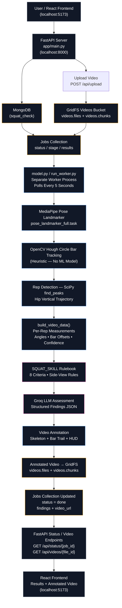

# AI Squat Analysis

An AI-powered squat-form analysis application. A user uploads a side-view
squat video; a background worker runs pose estimation, tracks the barbell,
detects reps, and sends the measurements to an LLM that grades each rep
against a document-derived rulebook (`SQUAT_SKILL`), returning per-criterion
findings plus an annotated video.

---

## ⚡ Tech Stack

| Layer | Technology |
|---|---|
| Frontend | React (Vite dev server, default `http://localhost:5173`) |
| Backend API | FastAPI (Python), served by Uvicorn |
| Background worker | Plain Python script (`model.py`), run as a **separate process** |
| Database | MongoDB — one `jobs` collection + a `videos` GridFS bucket |
| Pose estimation | MediaPipe Pose Landmarker (`pose_landmarker_full.task`) |
| Bar tracking | OpenCV Hough Circle Transform (heuristic, no ML model) |
| Rep detection | SciPy `find_peaks` on the hip's vertical trajectory |
| LLM assessment | Groq API (auto-selects an available chat model, e.g. Llama 3.3 / GPT-OSS) |
| Video re-encode | ffmpeg (optional, for browser-playable H.264 output) |

The backend is deliberately split into **two independent processes** that
only ever talk to each other through MongoDB — never directly:

- `app/` — the FastAPI server. Handles uploads, status polling, and
  streaming video back to the browser. It never touches MediaPipe, OpenCV,
  or Groq.
- `model.py` — the worker. Has zero HTTP endpoints. It polls MongoDB for
  unprocessed jobs, does all the heavy computer-vision and LLM work, and
  writes the results back onto the same job document.

This means the API stays fast and responsive while a squat video (which can
take anywhere from several seconds to a couple of minutes to process) is
being analyzed in the background.

---

## 🏗️ Architecture Diagram




## 🔍 How Detection Actually Works (Step by Step)

This is the detailed internals of `model.py`'s pipeline, in the order it executes for one job:

### Step 1 — Pose landmark extraction (MediaPipe)

- The video is opened with `cv2.VideoCapture`, read frame by frame.
- Each frame is fed to `PoseLandmarker` (MediaPipe's `pose_landmarker_full.task` model, running in `VIDEO` mode so it can use temporal smoothing).
- For each frame, 14 named landmarks are extracted: nose, both ears, both shoulders, both hips, both knees, both ankles, both heels, both foot indices — each with an `(x, y)` pixel position and a `visibility` score (0–1, MediaPipe's own confidence that the point is actually visible, not occluded).
- **Side selection**: since this is a side-view video, only one side of the body (left or right) is actually visible to the camera at any depth. For every frame where a person is detected, the pipeline compares the average visibility of the left-side landmarks vs. the right-side landmarks and "votes." Whichever side wins the most frames is used for the entire video's measurements (`pick_side()`).

### Step 2 — Barbell tracking (OpenCV, heuristic — no ML model)

- There is **no trained bar-detection model.** Instead, for every frame where a pose was detected, a search window is computed around the shoulder/hip position (roughly where a bar resting on the back would be).
- Inside that cropped region, `cv2.HoughCircles` looks for circular shapes (bar plates are circular in a side-view video) with a radius scaled to the person's torso length.
- If multiple circles are found, the one closest to the *previous* frame's bar position wins — this gives simple frame-to-frame continuity.
- The resulting per-frame bar positions are then smoothed with a small moving-average window (`smooth_bar_path`) to remove flicker.
- Every bar position is explicitly marked `is_estimate=True` — the video's legend overlay is honest about this: **the skeleton (green) is an observed MediaPipe landmark; the bar trail (orange) is always an estimate**, never claimed as ground truth.

### Step 3 — Rep detection

- The (side-selected) hip's vertical pixel position across all frames forms a signal: it rises and falls once per rep.
- `scipy.signal.find_peaks` finds the local peaks of that signal (i.e. the bottom of each squat, since y increases downward in image coordinates), requiring a minimum spacing (`min_rep_duration_s=0.8s`) and a minimum "prominence" (15% of the observed range) so that camera shake or noise isn't mistaken for a rep.
- Each detected peak becomes a `Rep` with a bottom frame index and a start/end frame range (the midpoint between adjacent peaks).

### Step 4 — Per-rep measurement contract (`build_video_data`)

For every detected rep, at its bottom frame, the pipeline computes:

- `hip_angle_deg`, `knee_angle_deg`, `back_angle_deg`, `head_neck_angle_deg` — joint angles from the landmark geometry (dot-product between the relevant bone vectors).
- `bar_x_offset_from_midfoot_px` — horizontal pixel distance between the tracked bar center and the ankle/foot-index midpoint (the standard's "balance over midfoot" criterion).
- `knee_forward_of_toe_px` — how far the knee sits ahead of the toe.
- Short trajectory samples of hip-y and shoulder-y across the first ~20% of the ascent (used by the LLM to judge "hip drive" direction).
- A `tracking_confidence` dict (0–1 per landmark, taken straight from MediaPipe's own visibility score, plus the bar's heuristic confidence).
- `occlusion_flags` — any measurement whose confidence falls below the floor (`CONFIDENCE_FLOOR`) is flagged here instead of silently reported.

This measurement object, plus `SQUAT_SKILL`, is exactly what gets sent to the LLM — **no raw video or images are ever sent to Groq**, only numeric measurements and the rulebook text.

### Step 5 — The skill (`SQUAT_SKILL`) — the rulebook the LLM must follow

`SQUAT_SKILL` in `model.py` is a plain Python dict — the "reusable, inspectable" skill required by the assignment brief. It is the **only** place squat-technique knowledge lives.

Each of its 8 criteria (`depth`, `back_angle`, `bar_path_balance`, `hip_drive_direction`, `knee_position`, `eye_gaze_head_position`, `bar_placement`, `stance_foot_turnout`) carries:

- `rule` — the plain-language standard, transcribed from the reference PDF.
- `source_pages` — which PDF pages that rule came from (for citation).
- `assessable_from_side_view` — `True`, `False`, or `"partial"`. This is explicit: e.g. `stance_foot_turnout` is marked `False` because a side-view video physically cannot show both feet's stance width, so the system always answers `cannot_assess` for it rather than guessing.

To update the rules, edit only this dict — nothing else in the pipeline needs to change.

### Step 6 — LLM assessment (Groq)

- `SYSTEM_PROMPT` instructs the model to use **only** the rules in `SQUAT_SKILL`, to never invent a numeric threshold, and to return `cannot_assess` whenever confidence is low, a landmark is occluded, or a criterion isn't assessable from a side view — an unassessable result is explicitly preferred over invented precision.
- The client calls `chat.completions.create(..., response_format={"type": "json_object"})`, so Groq is forced to return valid JSON matching the finding schema (one finding per rep × per criterion): `result` (`meets_standard` / `does_not_meet_standard` / `cannot_assess`), `observed_measurement`, `explanation`, `feedback`, `uncertainty`, and the `source_pages` copied straight from the skill.
- The Groq **model** itself isn't hardcoded: `get_groq_client_and_model()` calls `client.models.list()` and picks the first available model from a preference list (`openai/gpt-oss-120b`, `qwen/qwen3.6-27b`, `llama-3.3-70b-versatile`, ...), so it keeps working even if a specific model is deprecated on Groq's side.

### Step 7 — Annotation

- The buffered frames are re-walked once more: the skeleton (solid green lines/dots for observed landmarks), the bar trail (dashed orange), a HUD showing the current rep number and that rep's `depth` verdict, and a red "BOTTOM" border/frame flash on each rep's bottom frame.
- Written out with `cv2.VideoWriter` (`mp4v` codec), then — if `ffmpeg` is installed on the machine — re-encoded to H.264 so it plays reliably in Chrome/Edge (OpenCV's own `mp4v` output often won't play directly in a browser `<video>` tag).

### Step 8 — Writing results back

The final `results` object (summary, findings, per-rep measurements, the annotated video's new GridFS id, and a ready-to-use `video_url`) is written onto the **same job document**, and `status` flips to `"done"`. The React frontend, which has been polling `/api/status/{job_id}`, sees this on its next poll and renders the results.

## 🗂️ Where Everything Is Stored

MongoDB database: `squat_check` (configurable via `MONGO_DB_NAME`)

### `jobs` collection — one document per uploaded video

```json
{
  "_id": ObjectId("..."),
  "job_id": "f557983639bf4a1f8bd646c24cd1b21a",
  "original_filename": "istockphoto-....mp4",
  "content_type": "video/mp4",
  "size_bytes": 472466,
  "video_path": "data/uploads/....mp4",
  "video_storage": "mongodb_gridfs",
  "gridfs_file_id": ObjectId("..."),
  "status": "processing" | "done" | "error",
  "stage": "uploaded" | "processing_pose" | "assessing" | "annotating" | "saving" | "done" | "error",
  "stage_label": "human-readable status for the UI",
  "results": null | {
    "overall_summary": "...",
    "findings": [],
    "video_data": {},
    "video_url": "..."
  },
  "error": null | "error message string",
  "created_at": ISODate("..."),
  "updated_at": ISODate("..."),
  "model_video_window_seconds": 60
}
```

**`job_id` is a unique, randomly generated hex string** (`uuid.uuid4().hex`), generated in `app/main.py` at upload time. It is *not* the same as MongoDB's own `_id`.

It exists specifically so the frontend, the URL bar, and logs can all reference "this video's job" with one stable string, independent of Mongo's ObjectId format.

Both the FastAPI server (`GET /api/status/{job_id}`) and the worker (`python model.py --job-id <id>`) accept this same string to look up the exact same document.

### `videos` GridFS bucket — the actual video bytes

GridFS splits large files into chunks so MongoDB can store them like any other document (no separate file server needed).

It creates two internal collections automatically:

- `videos.files` — one entry per stored file, with metadata (filename, content type, upload timestamp, and the custom `job_id` / `original_filename` metadata this app attaches).
- `videos.chunks` — the actual binary data, split into ~255KB pieces.

Two files end up in GridFS per completed job: the **original** upload (referenced by `jobs.gridfs_file_id`) and the **annotated** output the worker produces (referenced by `jobs.results.annotated_gridfs_file_id`).

Both are streamed back to the browser through the same endpoint:

`GET /api/videos/{file_id}`.

### Local disk (`data/uploads/`, `data/outputs/`)

- `data/uploads/` — where `app/main.py` briefly writes the incoming upload before/while pushing it into GridFS. Ignored by git (see `.gitignore`); only structure (`.gitkeep`) is versioned.
- `data/outputs/` — mounted as static file storage (`/media`) by FastAPI; currently used as scratch space, since annotated videos are actually served from GridFS, not this folder, in the current flow.

---

## 💻 Setup

### Prerequisites

- Python 3.10+
- MongoDB running locally (`mongodb://127.0.0.1:27017`) or a connection string to a remote instance (e.g. MongoDB Atlas)
- A Groq API key — get one free at [**https://console.groq.com/keys**](https://console.groq.com/keys) (starts with `gsk_`)
- (Optional but recommended) `ffmpeg` installed and on your `PATH`, so the annotated video plays back correctly in the browser
- Node.js (if you're also running the React frontend)

###  Install Python dependencies

```bash
cd backend
python -m venv venv

# Windows:
venv\Scripts\activate

# macOS/Linux:
source venv/bin/activate

pip install -r requirements.txt
```

###  Configure environment variables — **where the Groq key goes**

```bash
cp .env.example .env
```

Open the new `.env` file and fill in your real values:

```env
MONGO_URI=mongodb://127.0.0.1:27017
MONGO_DB_NAME=squat_check
MONGO_DB=squat_check
GRIDFS_BUCKET=videos

GROQ_API_KEY=gsk_your_real_key_here
GROQ_MODEL=auto

UPLOAD_DIR=data/uploads
OUTPUT_DIR=data/outputs

MAX_VIDEO_SECONDS=60
MAX_UPLOAD_MB=1024
VIDEO_LOOKBACK_SECONDS=60

FRONTEND_ORIGINS=http://localhost:5173,http://127.0.0.1:5173
BACKEND_BASE_URL=http://localhost:8000
```

`.env` is gitignored — it will never be committed.

**Never** put a real key into `.env.example` or hardcode one inside `model.py` — both of those files are meant to be committed, and a key placed there is a public secret the moment it's pushed.

> `model.py` also has a `GROQ_API_KEY_IN_CODE` constant near the top, purely as a quick-hack override for people running the script directly outside the `.env` flow. Leave it as the placeholder text — `run_worker.py` loads the key from `.env` for you automatically, which is the supported path.

The first time the worker runs, it also downloads the MediaPipe pose model (`pose_landmarker_full.task`, ~30MB) automatically into `backend/models/` if it isn't already there — no manual download needed.

---

## ⚙️ Running the Backend — Two Separate Terminals

The API server and the analysis worker are **two independent processes**.

Both must be running at the same time for uploads to actually get processed, but they are started separately.

### Terminal 1 — start the FastAPI server

```bash
cd backend
venv\Scripts\activate
uvicorn app.main:app --reload --host 0.0.0.0 --port 8000
```

This exposes:

- `POST /api/upload` — accepts the video, stores it, creates the job
- `GET /api/status/{job_id}` — polled by the frontend for progress
- `GET /api/videos/{file_id}` — streams a video out of GridFS
- `GET /api/results?limit=50` — history of completed analyses
- `GET /api/health` — checks the API + MongoDB connection

Confirm it's up by opening:

`http://localhost:8000/api/health`

You should see:

```json
{
  "ok": true,
  "mongodb": "connected"
}
```

### Terminal 2 — start the model worker (separately, `model.py`)

```bash
cd backend
venv\Scripts\activate
python model.py
```

This is equivalent to `python model.py --watch`, except `run_worker.py` first loads `backend/.env` for you so the worker sees the same `MONGO_URI` / `GROQ_API_KEY` as the API server, without editing `model.py` itself.

It then polls MongoDB every 5 seconds for any job sitting at `stage="uploaded"`, and processes one at a time as they appear.

To process a single job once and exit (useful for debugging one specific upload) instead of watching forever:

```bash
python model.py --job-id f557983639bf4a1f8bd646c24cd1b21a
```

### Terminal 3 (optional) — the React frontend

```bash
cd frontend
npm install
npm run dev
```

Runs on `http://localhost:5173` by default and talks to the FastAPI server at `http://localhost:8000`.

**Startup order doesn't matter** — you can start the worker before or after the API server; they only communicate through MongoDB, not directly with each other.

A video uploaded while the worker happens to be offline simply sits at `stage="uploaded"` until the worker is started and picks it up on its next poll.

---

## 🚧 Known Limitations (for the build note / submission)

- **Bar tracking has no trained model** — it's a Hough-circle heuristic scoped to a region near the shoulder/hip. It can lose the bar under poor lighting, a cluttered background, or a bar that doesn't have visible plates. Every bar position is explicitly flagged as an estimate in both the data and the video overlay.
- **Side-view-only criteria**: `stance_foot_turnout` is always `cannot_assess` (needs a front-on view); `knee_position` only reports forward knee travel, never inward/outward (valgus) collapse.
- **Single-person only** (`num_poses=1` in the MediaPipe config) — a cluttered frame with a spotter standing close behind can confuse pose detection.
- **`ffmpeg` is optional but recommended** — without it, the annotated video is left in OpenCV's `mp4v` codec, which some browsers won't play inline.
- **Video length cap**: `MAX_VIDEO_SECONDS` (60s by default) — a longer video raises an error rather than truncating silently.
